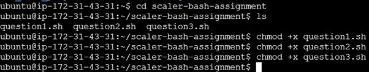

<h1> Scaler Assignment </h1>

Hello there, this is the assignment below. Clone this github repository and continue.

<h3> Pre-requisites </h3>

After cloning the github repository, make sure to convert all bash.sh files to executables

<h2> Outputs </h2>

<h3> Question1: Log File Analysis </h3>

<h3> Question2: Extract and Count File Types </h3>

<h3> Question3: Check Service Status </h3>

Thank you!
